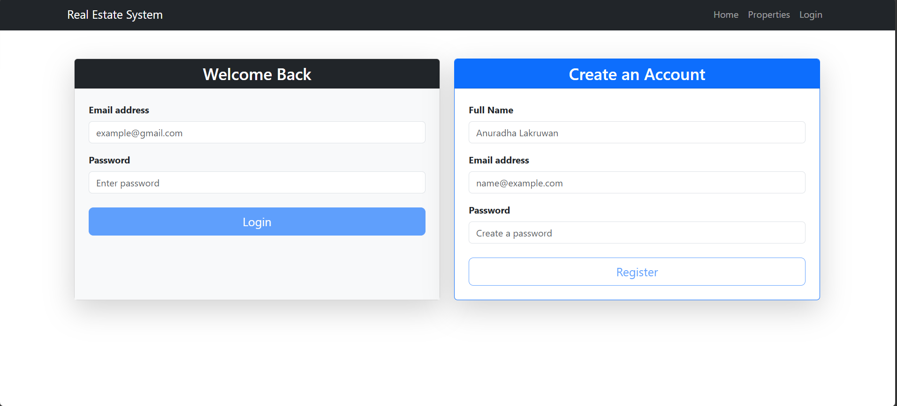
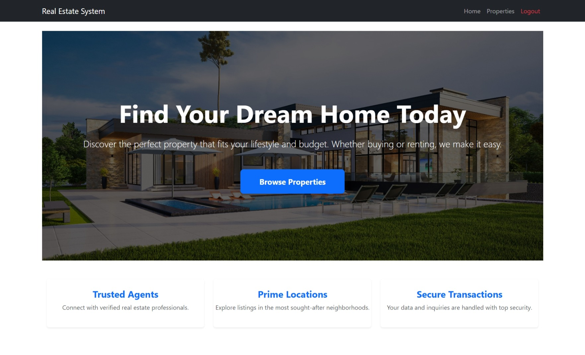
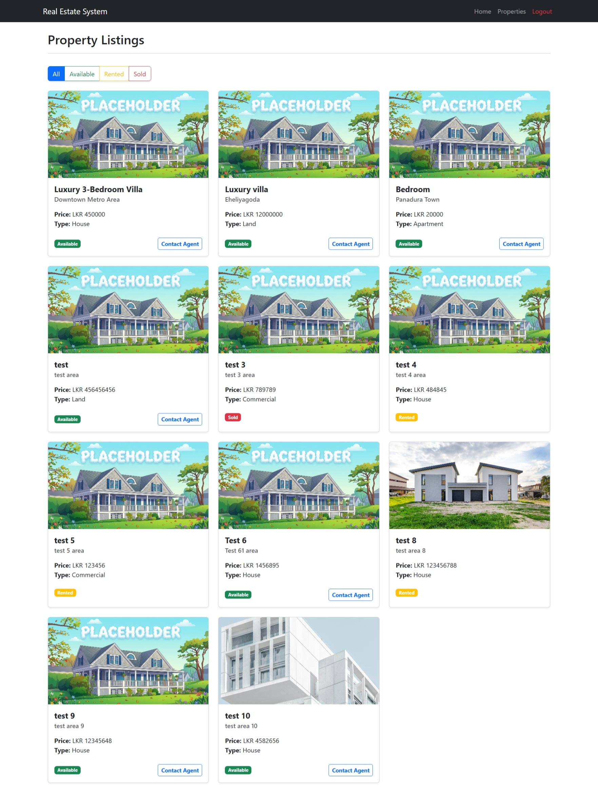
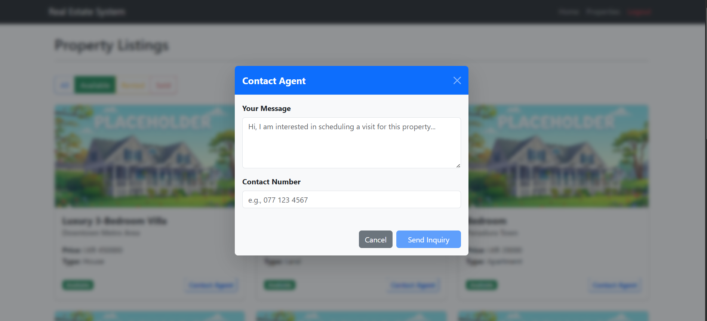
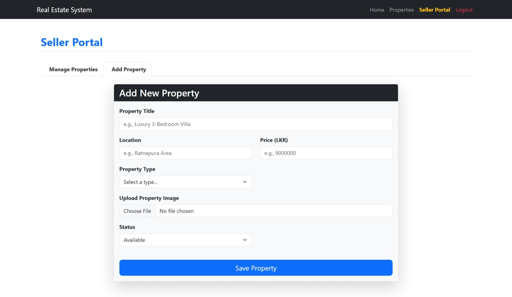
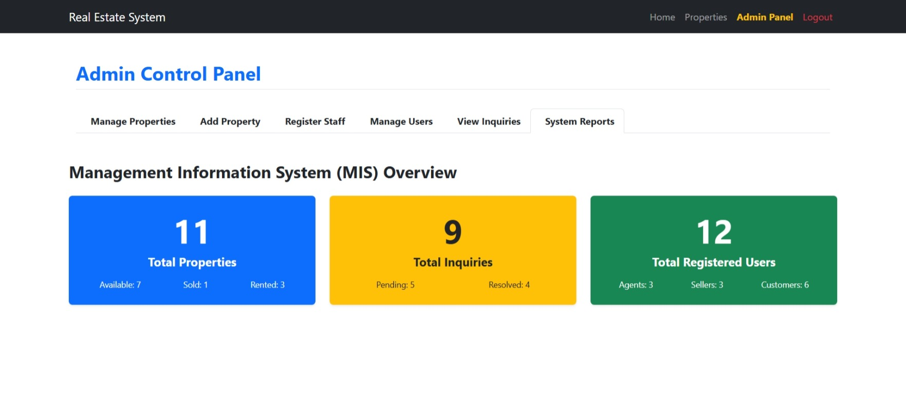

# Real Estate Management System
**Chosen Project:** Real Estate Management System

**Frontend GitHub Repository:** [https://github.com/Anuradha-117/real-estate-frontend]

**Backend GitHub Repository:** [https://github.com/Anuradha-117/real-estate-system-backend]

---

## 1. Project Overview
The Real Estate Management System is a full-stack web application designed to digitalize property transactions. It serves as a centralized platform connecting property sellers, prospective buyers (customers), and real estate agents. The system replaces manual property listings with an automated pipeline, allowing sellers to manage their inventory while giving customers a streamlined way to browse real estate and request agent assistance.

## 2. System Architecture
The application utilizes a standard Client-Server architecture, strictly separating the frontend interface from the backend logic and database.

**Presentation Layer (Frontend - Angular):**
* **Component-Based UI:** The interface is modularized into distinct views (Home, Catalog, Dashboards) to ensure maintainability.
* **Service Integration:** Angular Services manage asynchronous HTTP requests to the backend API, separating data fetching from UI rendering.
* **State & Routing:** Client-side routing handles navigation without page reloads, providing a Single Page Application (SPA) experience.

**Application & Data Layer (Backend - Spring Boot):**
* **RESTful Controllers:** Expose API endpoints to handle incoming client requests.
* **Service Layer:** Encapsulates business logic, including data validation and file processing.
* **Data Access (JPA/Hibernate):** Maps Java entity classes directly to MySQL database tables, handling CRUD operations without raw SQL queries.

## 3. Core Features & Implementations

* **Role-Based Access Control (RBAC):** The system enforces strict access levels. Route Guards protect specific frontend paths, while dynamic UI rendering ensures users only see tools relevant to their roles (Admin, Agent, Seller, Customer). For security, Admin accounts are explicitly filtered out of user management tables.
* **Property Catalog & File Storage:** Sellers can perform full CRUD operations on their listings. The system supports `multipart/form-data`, allowing users to upload high-resolution property images. Files are written to a local server directory, and the exact file path is saved in the MySQL database. A smart fallback system renders a custom placeholder if no image is provided.
* **Interactive UI Elements:** The property catalog includes CSS-driven hover animations and an integrated Bootstrap Lightbox modal, allowing buyers to enlarge property images interactively without navigating away from the catalog.
* **Inquiry Pipeline:** Customers can submit contact requests for specific properties. These requests populate an Agent-specific dashboard where agents can review details, contact the client, and mark the inquiry status as 'Resolved'.

## 4. MIS Reporting Dashboard
To support platform administrators, the system includes a Management Information System (MIS) dashboard. Instead of relying on manual database queries, the frontend dynamically calculates live metrics from the active datasets. It displays visual summaries of:
* Property availability metrics (Available, Sold, Rented).
* Inquiry resolution rates (Pending vs. Resolved).
* Detailed user demographics categorized by role.

## 5. Local Environment Setup & Configuration

**1. Database Configuration:**
Ensure MySQL is running on port 3306. Before starting the backend, open `src/main/resources/application.yaml` and update the database credentials to match your local MySQL environment:
```yaml
spring:
  datasource:
    url: jdbc:mysql://localhost:3306/real_estate_db?createDatabaseIfNotExist=true
    username: root
    password: 2424
```

**2. Admin Account Access (Auto-Seeded):**
The database schema will auto-generate via Hibernate when the backend starts.A Spring Boot `CommandLineRunner` is configured to automatically seed a default Administrator account into the database upon initial startup. 

Please log in with these credentials:
* **Email:** admin@system.com
* **Password:** admin123

## 6. Technology Stack
* **Frontend:** Angular, TypeScript, HTML5, CSS3, Bootstrap 5
* **Backend:** Java, Spring Boot, Spring Web, Spring Data JPA
* **Database:** MySQL
* **Version Control:** Git, GitHub

## 7. UI Previews

**System Login:**


**Home Page:**


**Property Catalog & Lightbox:**


**Property Inquiry Form:**


**Seller Upload Form:**


**MIS Admin Dashboard:**
